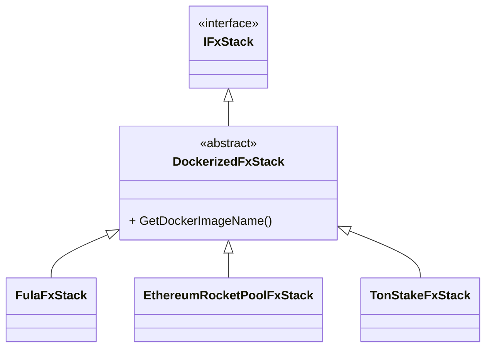

## What is a ‌FxStack?
In *FxBlox*, you work with your Blox tower. Your Blox can be configured to do lots of different stuff. It can run an Ethereum node (via Rocket Pool) or a Fula node to make it a blockchain-attached storage.
The interesting fact is that *FxFiles* is designed in a way so you can easily add support for a new type of workload. 

To add support for a new type of workload, you need only to write a `FxStack` for it. For example, if you want the app to support **Ehereum Validator** workload you need to write a class named `EthereumValidatorFxStack` which implements an `IFxStack` interface like this:

```csharp
public class EthereumValidatorFxStack : IFxStack
{
    // The implementation adds a new type of workload to Blox: Ethereum Validator
}
```

To understand the architecture you should get familiar with the basics of this design.

## Basic Models

## FxStack Architecture
To unify the development experience of facing different workloads (Fula, RocketPool Ethereum, TON Validator, ...) we use an abstraction called `IFxStack`. This abstraction represents all the requirements that a typical `FxStack` should expose.


